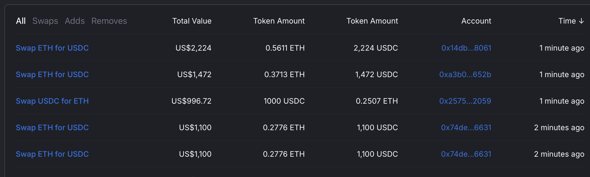
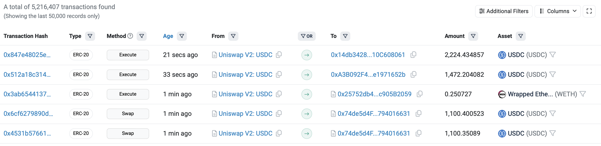
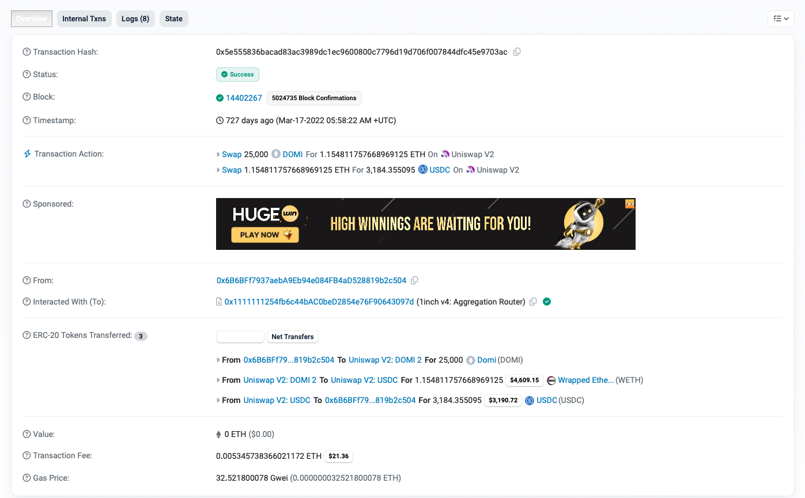
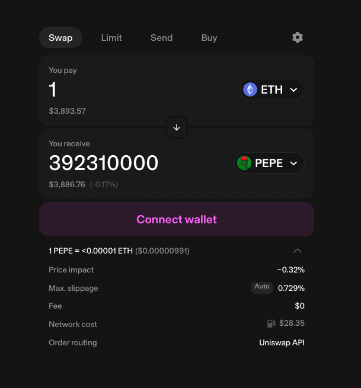
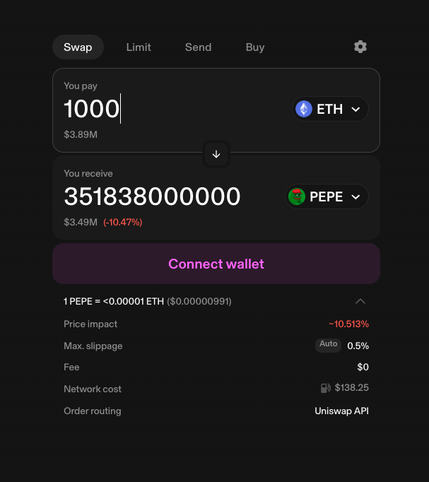

## Contract Calls Knowledge
Using https://polygon-rpc.com/ RPC node as a service, write the code and RPC call to obtain totalSupply of the MANA token issued on the Polygon (MATIC) blockchain.
```ruby
require "ethereum"

client = Ethereum::HttpClient.new('https://polygon-rpc.com/')
mana_contract_address = '0xA1c57f48F0Deb89f569dFbE6E2B7f46D33606fD4'
mana_contract_abi = [
  {
    "constant": true,
    "inputs": [],
    "name": "totalSupply",
    "outputs": [
      {
        "name": "",
        "type": "uint256"
      }
    ],
    "payable": false,
    "stateMutability": "view",
    "type": "function"
  }
]

mana_contract = Ethereum::Contract.create(name: 'MANA', address: mana_contract_address, abi: mana_contract_abi, client: client)
mana_contract.gas_price = 240_000_000_000
total_supply = mana_contract.call.total_supply

puts "Total Supply of MANA token: #{total_supply.to_s.insert(-19, '.')}"
```

## DEX event logs

1. Using the Etherscan block explorer, find a list of recent swaps for the following USDC/ETH pool on Uniswap V2?




2. https://etherscan.io/tx/0x5e555836bacad83ac3989dc1ec9600800c7796d19d706f007844dfc45e9703ac/ is a swap transaction on a Uniswap V2 pool. One of the associated swaps here is a trade from 1.15481 ETH to $3,184.35. Determine in the block explorer where that raw number is coming from and how it is being derived.

 
Uniswap V2 is an automated market maker (AMM). 
The price of the assets being swapped is determined by the ratio of those assets in the liquidity pool.
When a user wants to trade one asset for another, they submit a transaction to Uniswap.
It automatically calculates the amount of each asset that will be traded based on the current prices determined by the constant product formula (x * y = k).
When the swap was made, 1.154811757668969125 ETH was valued at $3,184.355095 USDC according to the formula.
```
Where X is the amount of ETH in the pool, Y is the amount of USDC in the pool, and K is the constant product of the two.
When we want to swap from ETH to USDC, we need to deposit dX amount of ETH and withdraw dY amount of USDC from the pool to maintain the K.

Before the Swap:
X * Y = K

After the Swap:
(X + dX) * (Y - dY) = K

Let's say we want to swap 1 ETH to USDC, then dX = 1 and dY is the amount of USDC we will get. We can calculate dY using the formula:
Y - dY = K / (X + dX)
dy = Y - (K / (X + dX))
dy = Y - (XY / (X + dX))
dy = (YX + YdX - XY) / (X + dX)
dy = (YdX) / (X + dX)
```

3. Quickswap, a DEX on Polygon (MATIC) allows users to swap two assets as a trade. For every swap transaction that is recorded on the blockchain, a swap event is emitted and stored in the network with this hash ID 0xd78ad95fa46c994b6551d0da85fc275fe613ce37657fb8d5e3d130840159d822. Write the RPC API call to get all the swap events that were emitted for the block #26444465. Use https://polygon-rpc.com/ RPC node as a service.
```ruby
require 'ethereum'
 
block_number = 26444465
hex_block_number = '0x' + block_number.to_s(16)
client = Ethereum::HttpClient.new('https://polygon-rpc.com/')
event = '0xd78ad95fa46c994b6551d0da85fc275fe613ce37657fb8d5e3d130840159d822'
 
 filter_options = {
   topics: [event],
   fromBlock: hex_block_number,
   toBlock: hex_block_number
 }
 logs = client.eth_get_logs(filter_options)
 puts logs["result"]
 ```
   
4. When using the Quickswap DEX, we noticed that the price impact is -42.09% when we increase the size of the trade. What does price impact mean, why is it important, the math behind the price impact.

The price impact is refers to the price difference between the market price and the actual price we will need to pay for the asset.
Similar to Uniswap V2, Quickswap DEX is an automated market maker (AMM) employing constant product formula (x * y = k).
When our trade size surpasses the liquidity pool's magnitude significantly, the resultant price impact amplifies, as the trade size induces more alteration in the asset ratio within the pool.
Below is some simple calculations of the price impact for the given trade sizes.
```
Before the Swap:
X = 1000
Y = 1000
K = 1000000
Market Price = 1

1. Swap 100 X for Y
X = 1100
Y = 909.0909090909 (K / X)
Received Y = 90.9090909091 (Y before the swap - Y after the swap)

Price paid per Y = 1.1 X

Price impact = (1.1 - 1 / 1) * 100 = 10%

                
2. Swap 500 X for Y
X = 1500
Y = 666.6666666667 (K / X)
Received Y = 333.3333333333 (Y before the swap - Y after the swap)

Price paid per Y = 1.5 X

Price impact = 50%
```
The following pictures show the price impact for the given trade sizes.


